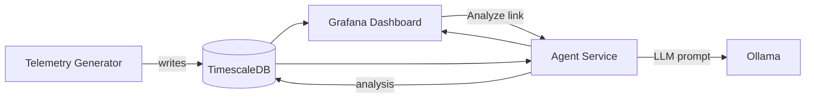

# dashboardAIagentDemo

Minimal "agentic observability" demo for maritime telemetry. This repo spins up TimescaleDB, Grafana, an agent service, a telemetry generator, and Ollama with Docker Compose. It shows an end-to-end flow from synthetic telemetry to AI explanations rendered in Grafana.

## Quick start (5-10 minutes)

Prereqs: Docker Desktop + Docker Compose.

1) Copy env template:

```bash
cp .env.example .env
```

2) Start services:

```bash
docker compose up --build
```

3) Pull a model for Ollama (one-time):

```bash
docker compose exec ollama ollama pull llama3:8b
```

4) Open Grafana:

- URL: http://localhost:3000
- User: admin
- Password: (from `.env`, default `admin`)

Dashboard: **Maritime Vessel Overview v3** (auto-provisioned).

## Demo script (live walkthrough)

1) Open the Grafana dashboard and select `vessel_001`.
2) Show top stat cards and the temp/RPM time series.
3) Scroll to the Event Log table and click the **Analyze** link on an event row.
   - The link triggers analysis in the agent and stores it in `ai_analyses`.
4) Refresh the dashboard or wait for the refresh interval; the **AI Insight** panel shows the latest analysis.

Optional CLI trigger:

```bash
curl -X POST http://localhost:8000/analyze \
  -H "Content-Type: application/json" \
  -d '{"event_id":"<EVENT_ID>"}'
```

Or analyze the latest event:

```bash
curl "http://localhost:8000/analyze/latest?vessel_id=vessel_001"
```

## Architecture



## MCP (agent endpoints)

The agent exposes MCP-style tool endpoints directly:

- `GET /mcp/tools` lists available tools and input schemas.
- `POST /mcp/call` routes a tool call to the agent logic.

No separate MCP proxy service is required for the demo.

## Services

- **TimescaleDB**: stores telemetry, events, and AI analyses.
- **Grafana**: visualizes metrics, event log, and AI insight panel.
- **Agent (.NET 8 Web API)**: analyses events, queries DB, calls Ollama, stores results.
- **Telemetry generator (.NET 8)**: inserts synthetic vessel telemetry + events.
- **Ollama**: local LLM (model configurable via `OLLAMA_MODEL`).

## API endpoints

Agent service (`http://localhost:8000`):

- `GET /health`
- `GET /events/latest?vessel_id=...`
- `POST /analyze { "event_id": "..." }`
- `GET /analyze?event_id=...`
- `GET /analyze/latest?vessel_id=...`
- `GET /mcp/tools`
- `POST /mcp/call`

## Data model

- `telemetry`: time-series sensor values
- `events`: detected anomalies
- `ai_analyses`: stored LLM responses (JSON)

## Future considerations (not implemented)

- RAG: add document embeddings and retrieval in the agent (`retrieve_context_stub` is in place).
- OPC-UA ingestion for real vessel telemetry.
- Azure Postgres/TimescaleDB hosting.

## Demo checklist

- [ ] `docker compose up --build` runs without errors
- [ ] Data appears in Grafana within 1-2 minutes
- [ ] Event Log populates and Analyze link works
- [ ] AI Insight panel shows a stored analysis
- [ ] Ollama model is pulled and responding
